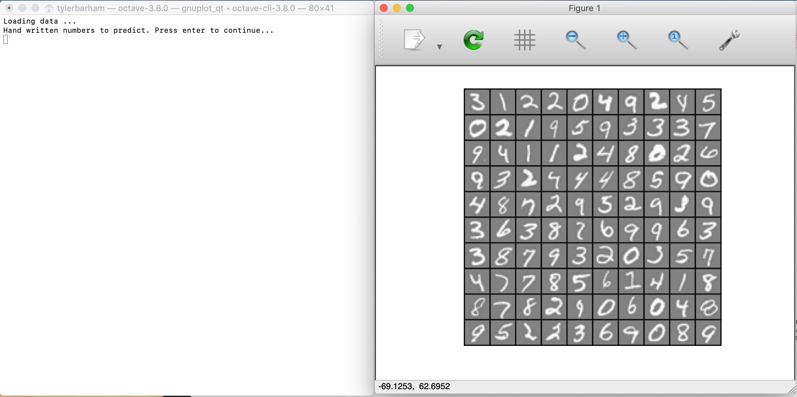

# Number predictor
This program demonstrates a neural network using backpropagation to predict handwritten numbers. The input images are 20x20 pixels, and the output will be the prediction of the image ranging from 0-9. The neural network is fully connected with one hidden layer and has a shape of 400x25x10 (excluding bias neurons). 

## Getting Started
These instructions will get you a copy of the project up and running on your local machine for development and testing purposes.

### Prerequisites
```
GNU Octave, version 3.8.0
```

### Installing
```
$ git clone https://github.com/Tyler-Barham/number-predictor.git
```

### Usage
```
$ cd ./number-predictor
$ octave-cli
$ main
```

#### Example output

_Figure 1._ A sample of 100 images from the dataset.


_Figure 2._ The neural network predicting the number in an image.
